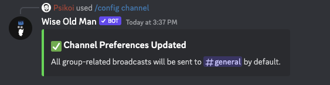
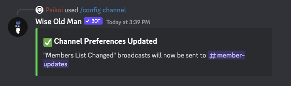
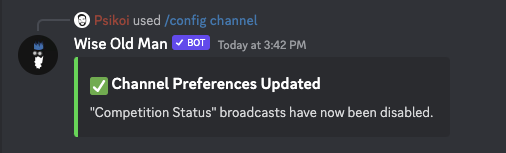
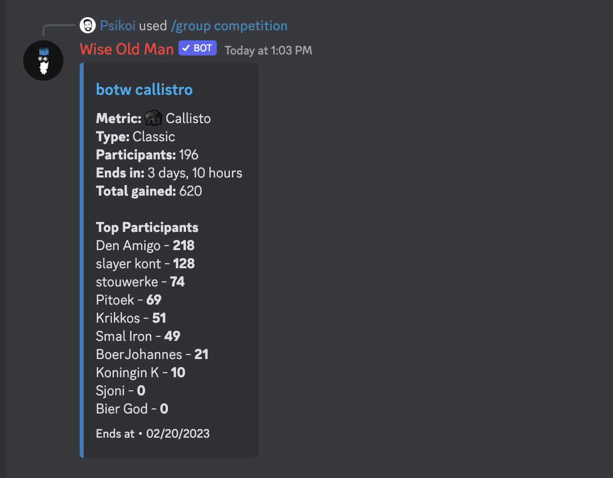
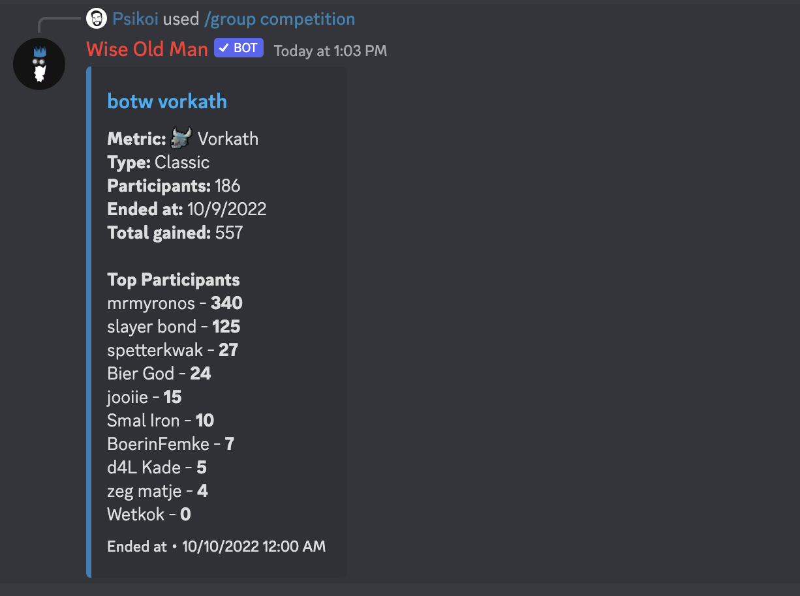

import CommandCall from '@site/src/components/CommandCall/CommandCall';

# Commands

You can call our bot's commands by typing `/` on Discord's chat box and browse our available commands. These are what Discord calls Application Commands (or Slash Commands) and they should not require the bot to be in the channel you're currently on.

 

---

## /help

By default (without specifying any categories), this command will provide you with a few useful links, and a detailed list of your configurations, including your currently tracked group and your notification channel configurations.

  
Example (default)

<CommandCall commandRoot="/help" />

 

Alternatively, you can choose to select a category to get specific info on that topic. The current categories are:

- RuneLite
- Plugin
- Sync
- Verified
- Permissions
- FAQ
- Flag

  
Example (flag category):

<CommandCall commandRoot="/help" options={[{ key: 'category', value: 'Flag' }]} />

 

 

---

## /config group

To use any group-specific commands, or receive group-related [notifications](/notifications), the bot needs to know what group your server is interested in.

This command allows you to specify a group ID, and the bot will use that ID for any future group-related commands or notifications.

:::info
If you don't know your group's ID, it should be the number in your group's wiseoldman.net page URL.

:::

 

  
Example

<CommandCall commandRoot="/config group" options={[{ key: 'group_id', value: '139' }]} />

 

 

---

## /config channel

Besides commands, this bot also can send [notifications](/notifications) to your Discord when something happens to one of your members (new achievements, HCIM death, etc), or to your competitions (started, ended, starting soon, etc).

For this, the bot needs to know where to send those notifications, and since there are many types of notifications, you need to either specify where to receive each type, disable a type, or just **assign a default notifications channel**.

The current notification types are:

- Default
- Competition Status
- Member Achievements
- Member Name Changed
- Member (HCIM) Died
- Members List Changed

:::info
The bot will check for permissions (by sending a message and immediately deleting it) in the selected channel before accepting this configuration, if you choose to remove permissions after configuration, it will simply stop working.
:::

 

  
Example (default channel)

<CommandCall
  commandRoot="/config channel"
  options={[
    { key: 'notification_type', value: 'Default' },
    { key: 'notification_channel', value: '#general' }
  ]}
/>

 

  
Example (specific notification type)

<CommandCall
  commandRoot="/config channel"
  options={[
    { key: 'notification_type', value: 'Members List Changed' },
    { key: 'notification_channel', value: '#member-updates' }
  ]}
/>

 

  
Example (disabling a notification type)

<CommandCall
  commandRoot="/config channel"
  options={[
    { key: 'notification_type', value: 'Competition Status' },
    { key: 'notification_channel', value: '#general' },
    { key: 'status', value: 'Disable' }
  ]}
/>

 

 

---

## /group details

 

:::caution
Requires group ID configuration. [Learn how to set this up](#config-group).
:::

 

This command will provide you with your group's details, such as name, clan chat, members count, etc.

 

  
Example

<CommandCall commandRoot="/group details" />

 

 

---

## /group members

 

:::caution
Requires group ID configuration. [Learn how to set this up](#config-group).
:::

 

This command will provide you with a list of your group's members. You can use the `<` and `>` buttons to navigate through the list.

 

  
Example

<CommandCall commandRoot="/group members" />

 

 

---

## /group competitions

 

:::caution
Requires group ID configuration. [Learn how to set this up](#config-group).
:::

 

This command will show you a list of your group's upcoming (or recent) competitions.

 

  
Example

<CommandCall commandRoot="/group competitions" />

 

 

---

## /group competition

 

:::caution
Requires group ID configuration. [Learn how to set this up](#config-group).
:::

 

This command will show you the details of one of your group's competitions.
If no "ID" parameter is provided, it will try to show the current ongoing competition, or an upcoming one if there are no ongoing competitions.

You can choose to give it an ID parameter, to see a specific competition. You can find the ID of a competition in the URL of its https://wiseoldman.net page, or by using the `/group competitions` command.

 

  
Example (default)

<CommandCall commandRoot="/group competition" />

 

  
Example (specific ID)

<CommandCall
  commandRoot="/group competition"
  options={[
    {
      key: 'group_id',
      value: '15832'
    }
  ]}
/>

 

 

---

## /group gained

 

:::caution
Requires group ID configuration. [Learn how to set this up](#config-group).
:::

 

This command shows you a leaderboard of your group's members, sorted by their gained exp/kc/score (in a specific skill/boss/activity) within a given time period.

 

  
Example

<CommandCall
  commandRoot="/group gained"
  options={[
    { key: 'metric', value: 'Strength' },
    { key: 'period', value: 'Month' }
  ]}
/>

 

 

---

## /group hiscores

 

:::caution
Requires group ID configuration. [Learn how to set this up](#config-group).
:::

 

This command shows you a leaderboard of your group's members, sorted by current exp/kc/score in a specific skill/boss/activity.

 

  
Example

<CommandCall commandRoot="/group hiscores" options={[{ key: 'metric', value: 'Zulrah' }]} />

 

 

---

## /group records

 

:::caution
Requires group ID configuration. [Learn how to set this up](#config-group).
:::

 

This command shows you a leaderboard of your group's members records, sorted by their gained exp/kc/score (in a specific skill/boss/activity) within a given time period.

 

  
Example

<CommandCall
  commandRoot="/group records"
  options={[
    { key: 'metric', value: 'Farming' },
    { key: 'period', value: 'Week' }
  ]}
/>

 

 
