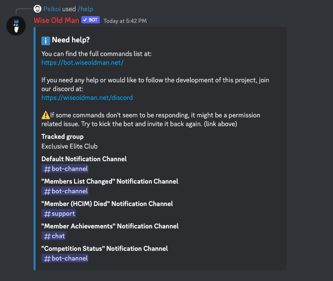
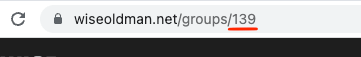
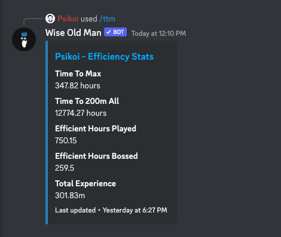

import Badge from '@site/src/components/Badge/Badge';
import CommandCall from '@site/src/components/CommandCall/CommandCall';

# Commands

You can call our bot's commands by typing `/` on Discord's chat box and browse our available commands. These are what Discord calls Application Commands (or Slash Commands) and they should not require the bot to be in the channel you're currently on.

 

---

## General commands

 

### /help

By default (without specifying any categories), this command will provide you with a few useful links, and a detailed list of your configurations, including your currently tracked group and your notification configurations.

#### Example (default)

<CommandCall commandRoot="/help" />

 

Alternatively, you can choose to select a category to get specific info on that topic. The current categories are:

- RuneLite
- Plugin
- Sync
- Verified
- Permissions
- FAQ
- Flag

#### Example (flag category):

<CommandCall commandRoot="/help" options={[{ key: 'category', value: 'Flag' }]} />

 

 

---

## Config commands

 

### /config group

<Badge>Requires Admin Permissions</Badge>
 
 

To use any group-specific commands, or receive group-related [notifications](/notifications), the bot needs to know what group your server is interested in.

This command allows you to specify a group ID, and the bot will use that ID for any future group-related commands or notifications.

:::info
If you don't know your group's ID, it should be the number in your group's wiseoldman.net page URL.

:::

 

#### Example

<CommandCall commandRoot="/config group" options={[{ key: 'group_id', value: '139' }]} />

 

 

---

### /config notifications

<Badge>Requires Admin Permissions</Badge>
 
 

Besides commands, this bot can also send [notifications](/notifications) to your Discord server when something happens to one of your group members (new achievements, HCIM death, etc), or to your competitions (started, ended, starting soon, etc).

For this, the bot needs to know where to send those notifications, and since there are many types of notifications, you need to either specify where to receive each type, disable a type, or just **assign a default notifications channel**.

The current notification types are:

- Default
- Competition Status
- Member Achievements
- Member Name Changed
- Member (HCIM) Died
- Members Joined
- Members Left
- Members Roles Changed

:::info
The bot will check for permissions (by sending a message and immediately deleting it) in the selected channel before accepting this configuration, if you choose to remove permissions after configuration, it will simply stop working.
:::

 

#### Example (default channel)

<CommandCall
  commandRoot="/config notifications"
  options={[
    { key: 'notification_type', value: 'Default' },
    { key: 'notification_channel', value: '#general' }
  ]}
/>

 

 

#### Example (specific notification type)

<CommandCall
  commandRoot="/config notifications"
  options={[
    { key: 'notification_type', value: 'Members Roles Changed' },
    { key: 'notification_channel', value: '#chat' }
  ]}
/>

 

 

#### Example (disabling a notification type)

<CommandCall
  commandRoot="/config notifications"
  options={[
    { key: 'notification_type', value: 'Competition Status' },
    { key: 'notification_channel', value: '#general' },
    { key: 'status', value: 'Disable' }
  ]}
/>

 

 

---

## Group commands

### /group details

 

:::caution
Requires group ID configuration. [Learn how to set this up](#config-group).
:::

 

This command will provide you with your group's details, such as name, clan chat, members count, etc.

 

#### Example

<CommandCall commandRoot="/group details" />

 

 

---

### /group members

 

:::caution
Requires group ID configuration. [Learn how to set this up](#config-group).
:::

 

This command will provide you with a list of your group's members. You can use the `<` and `>` buttons to navigate through the list.

 

#### Example

<CommandCall commandRoot="/group members" />

 

 

---

### /group competitions

 

:::caution
Requires group ID configuration. [Learn how to set this up](#config-group).
:::

 

This command will show you a list of your group's upcoming (or recent) competitions.

 

#### Example

<CommandCall commandRoot="/group competitions" />

 

 

---

### /group competition

 

:::caution
Requires group ID configuration. [Learn how to set this up](#config-group).
:::

 

This command will show you the details of one of your group's competitions.
If no "ID" parameter is provided, it will try to show the current ongoing competition, or an upcoming one if there are no ongoing competitions.

You can choose to give it an ID parameter, to see a specific competition. You can find the ID of a competition in the URL of its https://wiseoldman.net page, or by using the `/group competitions` command.

 

#### Example (default)

<CommandCall commandRoot="/group competition" />

 

 

#### Example (specific ID)

<CommandCall
  commandRoot="/group competition"
  options={[
    {
      key: 'group_id',
      value: '15832'
    }
  ]}
/>

 

 

---

### /group gained

 

:::caution
Requires group ID configuration. [Learn how to set this up](#config-group).
:::

 

This command shows you a leaderboard of your group's members, sorted by their gained exp/kc/score (in a specific skill/boss/activity) within a given time period.

 

#### Example

<CommandCall
  commandRoot="/group gained"
  options={[
    { key: 'metric', value: 'Strength' },
    { key: 'period', value: 'Month' }
  ]}
/>

 

 

---

### /group hiscores

 

:::caution
Requires group ID configuration. [Learn how to set this up](#config-group).
:::

 

This command shows you a leaderboard of your group's members, sorted by current exp/kc/score in a specific skill/boss/activity.

 

#### Example

<CommandCall commandRoot="/group hiscores" options={[{ key: 'metric', value: 'Zulrah' }]} />

 

 

---

### /group records

 

:::caution
Requires group ID configuration. [Learn how to set this up](#config-group).
:::

 

This command shows you a leaderboard of your group's members records, sorted by their gained exp/kc/score (in a specific skill/boss/activity) within a given time period.

 

#### Example

<CommandCall
  commandRoot="/group records"
  options={[
    { key: 'metric', value: 'Farming' },
    { key: 'period', value: 'Week' }
  ]}
/>

 

 

---

## Player commands

 

### /update

 

:::info
This command (along with most other player commands) accepts an optional "username" parameter to specify the player you're refering to.

If no username is provided, it will default to the username linked to the Discord user who sent the command.

You can link your Discord user to a username using the [`/setrsn`](/commands#setrsn) command.
:::

 

This command will send an update request to the Wise Old Man servers, which will then update your stats, records, achievements, etc.

 

#### Example

<CommandCall commandRoot="/update" />

 

 

---

### /stats

 

:::info
This command (along with most other player commands) accepts an optional "username" parameter to specify the player you're refering to.

If no username is provided, it will default to the username linked to the Discord user who sent the command.

You can link your Discord user to a username using the [`/setrsn`](/commands#setrsn) command.
:::

 

This command will provide you with a player's skilling stats. It supports 4 different variants: **levels**, **experience**, **ranks** or **EHP**.

 

#### Example (levels, specific username)

<CommandCall
  commandRoot="/stats"
  options={[
    { key: 'variant', value: 'Levels' },
    { key: 'username', value: 'Zezima' }
  ]}
/>

 

 

#### Example (experience, no username)

<CommandCall commandRoot="/stats" options={[{ key: 'variant', value: 'Experience' }]} />

 

 

---

### /bosses

 

:::info
This command (along with most other player commands) accepts an optional "username" parameter to specify the player you're refering to.

If no username is provided, it will default to the username linked to the Discord user who sent the command.

You can link your Discord user to a username using the [`/setrsn`](/commands#setrsn) command.
:::

 

This command will provide you with a player's bossing stats. It supports 3 different variants: **killcounts**, **ranks** or **EHB**.

 

#### Example (killcounts, specific username)

<CommandCall
  commandRoot="/bosses"
  options={[
    { key: 'variant', value: 'Kill Counts' },
    { key: 'username', value: 'Zezima' }
  ]}
/>

 

 

#### Example (EHB, no username)

<CommandCall commandRoot="/stats" options={[{ key: 'variant', value: 'Efficient Hours Bosses' }]} />

 

 

---

### /activities

 

:::info
This command (along with most other player commands) accepts an optional "username" parameter to specify the player you're refering to.

If no username is provided, it will default to the username linked to the Discord user who sent the command.

You can link your Discord user to a username using the [`/setrsn`](/commands#setrsn) command.
:::

 

This command will provide you with a player's activity (minigames, etc) stats. It supports 2 different variants: **scores** and **ranks**.

 

#### Example (scores, specific username)

<CommandCall
  commandRoot="/activities"
  options={[
    { key: 'variant', value: 'Scores' },
    { key: 'username', value: 'Zezima' }
  ]}
/>

 

 

#### Example (ranks, no username)

<CommandCall commandRoot="/activities" options={[{ key: 'variant', value: 'Ranks' }]} />

 

 

---

### /ttm

 

:::info
This command (along with most other player commands) accepts an optional "username" parameter to specify the player you're refering to.

If no username is provided, it will default to the username linked to the Discord user who sent the command.

You can link your Discord user to a username using the [`/setrsn`](/commands#setrsn) command.
:::

 

This command will provide you with a player's Efficiency stats, such as Time to Max, Time to 200m All, EHP, EHB, etc.

 

#### Example

<CommandCall commandRoot="/ttm" options={[{ key: 'username', value: 'Psikoi' }]} />

 

 

---

### /achievements

 

:::info
This command (along with most other player commands) accepts an optional "username" parameter to specify the player you're refering to.

If no username is provided, it will default to the username linked to the Discord user who sent the command.

You can link your Discord user to a username using the [`/setrsn`](/commands#setrsn) command.
:::

 

This command will provide you with a player's most recent achievements.

 

#### Example

<CommandCall commandRoot="/achievements" options={[{ key: 'username', value: 'Psikoi' }]} />

 

 

---

### /gained

 

:::info
This command (along with most other player commands) accepts an optional "username" parameter to specify the player you're refering to.

If no username is provided, it will default to the username linked to the Discord user who sent the command.

You can link your Discord user to a username using the [`/setrsn`](/commands#setrsn) command.
:::

 

This command will provide you with a player's gains within the past specified period. This command is also paginated, you can use the `>` and `<` buttons to navigate between pages.

 

#### Example (no username, year period)

<CommandCall commandRoot="/gained" options={[{ key: 'period', value: 'year' }]} />

 

 

#### Example (specific username, month period)

<CommandCall
  commandRoot="/gained"
  options={[
    { key: 'period', value: 'month' },
    { key: 'username', value: 'rro' }
  ]}
/>

 

 

---

### /setrsn

 

This command will link your Discord user to a RuneScape username. This will allow you to use commands that require a username without having to specify your in-game username every time.

 

#### Example

<CommandCall commandRoot="/setrsn" options={[{ key: 'username', value: 'Psikoi' }]} />

 

 

---
