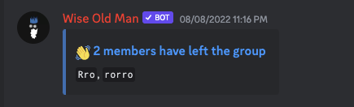
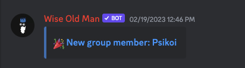
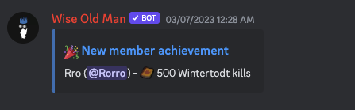
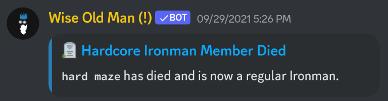
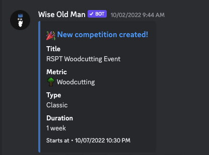
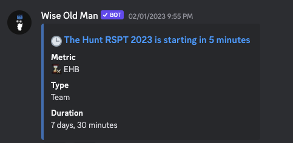
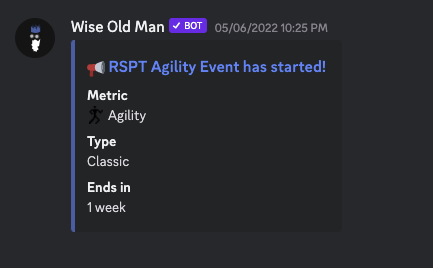
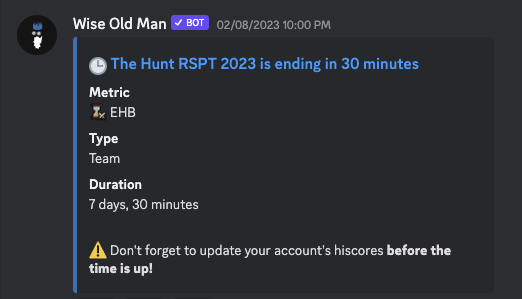
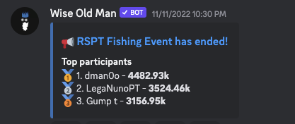
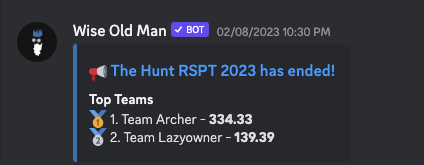

# Notifications

Besides commands, this bot can also send notifications to your Discord server when something happens to one of your group members (new achievements, HCIM death, etc), or to your competitions (started, ended, starting soon, etc).

For this, the bot needs to know what your group is and where to send those notifications, and since there are many types of notifications, you need to either specify where to receive each type, disable a type, or just **assign a default notifications channel**.

 

:::caution
Notifications are only sent if configured properly beforehand. Learn more about these configurations here:

- [Configuring Group ID](/commands#config-group)
- [Configuring Notifications](/commands#config-notifications)

The bot also needs certain permissions to be able to speak in the channel you want to receive notifications in without being mentioned. Here are the current required permissions:

- Send messages
- Manage messages
- Embed links
- Attach files
- Use application commands

:::

 

---

## Member Joined / Left

This notification is sent when a member joins or leaves the group.

:::info
To configure this notification, you can use the "Members List Changed" notification type in the `/config notifications` command.
:::

 

 

---

## New Member Achievement

This notification is sent when a member gains a new achievement.

:::info
To configure this notification, you can use the "Members Achievements" notification type in the `/config notifications` command.
:::

 

 

---

## Member (HCIM) has died

This notification is sent when an HCIM member dies (and becomes a regular Ironman)

:::info
To configure this notification, you can use the "Member (HCIM) died" notification type in the `/config notifications` command.
:::

 

 

---

## Competition Created

This notification is sent when a group competition is created.

:::info
To configure this notification, you can use the "Competition Status" notification type in the `/config notifications` command.
:::

 

 

---

## Competition Starting

This notification is sent when a group competition is starting soon. The time periods aren't configurable at the moment, this notification is sent multiple times before the competition starts.

- 6 Hours
- 5 Minutes

:::info
To configure this notification, you can use the "Competition Status" notification type in the `/config notifications` command.
:::

 

 

---

## Competition Started

This notification is sent when a group competition has started.

:::info
To configure this notification, you can use the "Competition Status" notification type in the `/config notifications` command.
:::

 

 

---

## Competition Ending

This notification is sent when a group competition is ending soon. The time periods aren't configurable at the moment, this notification is sent multiple times before the competition ends.

- 12 hours
- 30 Minutes

:::info
To configure this notification, you can use the "Competition Status" notification type in the `/config notifications` command.
:::

 

 

---

## Competition Ended

This notification is sent when a group competition has ended. It also includes the top participants or teams.

:::info
To configure this notification, you can use the "Competition Status" notification type in the `/config notifications` command.
:::

 

#### Example (Classic competition, showing top participants):

 

#### Example (Team competition, showing top teams):

 

---
