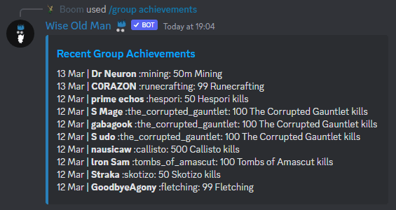

# Troubleshooting

## "The bot isn't responding to my commands"

This is almost always a permissions issue. Make sure that the bot has the following permissions:

- Send messages
- Manage messages `(this is required for some paginated commands)`
- Embed links
- Attach files `(this is required for some image-based commands)`
- Use application commands

A good first step is to kick and re-invite the bot to your server, this will try to give the bot the latest required permissions. You can do this directly from inside Discord by clicking on the bot (right-side member list) and then clicking the "Add to server" button that appears in the bot's profile. You won't need to re-configure your group or notifications, those are saved in our database.

Also make sure there's no role or channel permissions overriding the bot's permissions.

:::tip
A good way to check if it's a permissions issue, is to temporarily give the bot the "Administrator" role, and trying to call the command again. If it responds this time, then you know that it's missing permissions (that were given to the "Administrator" role).
:::

---

## "The bot isn't sending notifications"

Similarly to the situation above, this is often a permissions issue.

First, check that you have configured notifications for whatever event is happening (member list changed, new competition started, etc), by using the `/help` command (with no category selected). This will show you your current notification settings.

If you have confirmed that the "notification type" is properly assigned to a channel, then make sure the bot is invited and has speaking permissions on that channel. [See permissions troubleshooting above](/troubleshooting#the-bot-isnt-responding-to-my-commands)

:::tip
A good way to check if the bot has viewing and speaking permissions on that channel, is to re-configure the notification settings for that event (with `/config notifications`), if it doesn't have the required permissions on that channel, it'll show you an error message explaining what went wrong.
:::

---

## "The bot isn't showing emojis correctly"

This a known bug with Discord, and the to fix it, make sure that `@everyone` role has the `Use external emoji` permission enabled.
